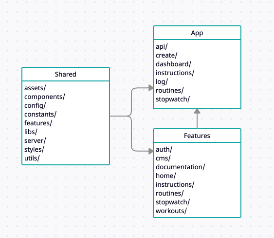

# Big 6 Fitness App

## Introduction

The Big 6 Progressive Callisthenics Fitness App is inspired by Paul Wade's "Convict Conditioning," a comprehensive guide to bodyweight strength training. The app aims to help users track their progress through the Big Six exercises, eventually mastering advanced movements like the one-arm handstand push-up.

### Key Features

-   User Registration and Authentication:
    -   Sign-up/Login functionality
    -   Profile management
-   Exercise Database:
    -   Comprehensive database of exercises and progressions from the book
    -   Detailed descriptions and instructional videos
-   Progress Tracking:
    -   Track sets, reps, and progression levels for each exercise
    -   Visual progress graphs
-   Workout Planner:
    -   Customizable workout plans based on user goals
    -   Pre-designed workout routines based on the Convict Conditioning program
-   Timer:
    -   timer for handstands
-   Reports:
    -   Weekly and monthly progress reports

## Table of Contents

-   [Big 6 Fitness App](#big-6-fitness-app)
    -   [Introduction](#introduction)
        -   [Key Features](#key-features)
    -   [Table of Contents](#table-of-contents)
    -   [Testing Strategy](#testing-strategy)
    -   [Design Patterns](#design-patterns)
    -   [Folder Structure](#folder-structure)
        -   [app/](#app)
        -   [features/](#features)
        -   [server/](#server)
        -   [components/](#components)
        -   [Rationale](#rationale)
    -   [Database Structure](#database-structure)
        -   [Importance of Robust Error Handling](#importance-of-robust-error-handling)
        -   [API Error Handling](#api-error-handling)
            -   [Example Usage in API Logic](#example-usage-in-api-logic)
            -   [Error Handling in API Route](#error-handling-in-api-route)
            -   [Error Handler Class](#error-handler-class)
        -   [Frontend Error Handling](#frontend-error-handling)
    -   [A11y](#a11y)
    -   [Installation](#installation)
    -   [Usage](#usage)

## Testing Strategy

[Detailed explanation of the testing strategy you adopted for the project. This could include types of tests (unit, integration, end-to-end), tools used (e.g., Jest, React Testing Library), and how to run the tests.]

## Design Patterns

[Description of the design patterns implemented in the project. Explain why you chose them and how they help in structuring and maintaining the code.]

## Folder Structure

The project is organized in a feature fashion to ensure maintainability, scalability, and ease of navigation. We are using [eslint-plugin-boundaries](https://www.npmjs.com/package/eslint-plugin-boundaries) to enforce the folder structure and ensure that files are placed in the correct directories.



### app/

The app/ directory is used for the new Next.js routing system. This folder contains the route definitions and page files only.

### features/

The features directory contains the main application logic, organized by feature. Each [feature] subfolder includes:

-   components/: Reusable UI components specific to the feature.
-   utils/: Small utility functions and helper functions specific to the feature.
-   schemas/: Data validation schemas normally using Zod.
-   libs/: Usually external libraries or services used by the feature. But could also be a bigger library of internally written utility functions.

### server/

Shared server-side code that is used by the API and the Next.js app.

### components/

The components directory contains shared UI components that are used across multiple features. Each component is organized into its own folder and sub-folders for related files.

### styles/

The styles directory contains global styles and design tokens. Not a complete list but as follows.

-   base/: Base styles such as resets, typography, etc.
-   breakpoints/: Media queries for responsive design.
-   colors/: Color variables and themes.
-   utilityClasses/: Utility classes for common styles.
-   main.scss: The main stylesheet that imports all other style files.

### Rationale

This structure is designed to promote a clear separation of concerns, making the codebase easier to navigate and maintain. By grouping related files together, each part of the application is isolated, which enhances modularity and testability. This organization also facilitates collaboration, as developers can work on different features independently without causing conflicts.

## Database Structure

### Importance of Robust Error Handling

Robust error handling is critical for the development and maintenance of any application. It significantly aids in debugging by providing clear and informative error messages, which helps developers quickly identify and resolve issues. You cn tell a lot about a programmer by the way he handles errors.

### API Error Handling

-   Custom Error Class: A custom ApiBaseError class is defined to standardize error handling with various properties such as codeName, httpCode, description, isOperational, response, and cause.
-   Error Constants: Defined constants for common API error names and corresponding HTTP status codes.
-   Error Throwing: Use the ApiError class to throw errors within your API logic.
-   Centralized Error Handling: A centralized ErrorHandler class is used to catch and handle errors in the API route, distinguishing between different error types and responding accordingly.
-   Logging: Errors are logged further analysis.

#### Example Usage in API Logic

```typescript
private getEmailFromHeaders(): string {
  const safe = emailSchema.safeParse(this.request.headers.get("x-user-email"));
  if (!safe.success) {
    throw new ApiForbiddenError({
      description: "Forbidden",
      isOperational: true,
    });
  }
  return safe.data;
}
```

#### Error Handling in API Route

```typescript
import ErrorHandler from "@/modules/api/error-handler/ErrorHandler"
import { NextRequest } from "next/server"

import WorkoutsController from "../../../modules/api/workouts/controller/workouts.controller"

export async function GET(request: NextRequest) {
    try {
        const controller = new WorkoutsController(request)
        return await controller.GET()
    } catch (error) {
        const errorHandler = new ErrorHandler(error)
        const errorResponse = errorHandler.handle()
        return errorResponse
    }
}
```

#### Error Handler Class

```typescript
class ErrorHandler {
    error: unknown

    constructor(error: unknown) {
        this.error = error
    }

    handle(): NextResponse<ErrorResponse> {
        if (
            !(this.error instanceof ApiBaseError) ||
            this.error instanceof ZodError ||
            (this.error instanceof ApiBaseError && !this.error.isOperational)
        ) {
            this.logToDatabase()
            return this.handleNonOperationalError()
        }

        return this.handleOperationalError(this.error)
    }
    // rest of error handler
}

export default ErrorHandler
```

### Frontend Error Handling

[Details on how frontend errors are managed. This could include error boundaries in React to catch and handle rendering errors, user-friendly error messages, and logging errors to external services for monitoring and analysis.]

## A11y

Accessibility is important for a few reason and mostly because it's just the right thing to do. Though this can be hard to get everyone on board and caring about it enough to make any changes needed. I've added some jest tests to help catch about 30% of these violation automatically and help me learn more as I go. I find doing something today to be 1% better tomorrow we will all be good at the things we want to be.

Add this script to every pages test file.

```typescript
import { render } from '@testing-library/react';
import { axe, toHaveNoViolations } from 'jest-axe';
import Page from './Page';

expect.extend(toHaveNoViolations);

it("should render without a11y violations", async () => {
  const { container } = render(<Page />);
  const results = await axe(container);

  expect(results).toHaveNoViolations();
});
```

## Installation

```bash
git clone https://github.com/sjblurton/big-6-app.git
cd big-6-app
npm install
```

## Usage

To run in dev

```bash
npm run dev
```

There's a number of other scripts to help with the development process. There's testing, there's scss typing, linting, formatting, and type checking. There's also a `precommit` script that has to pass the it's tests to let you commit.

```json
{
    "dev": "next dev",
    "generate-scss-types:watch": "npx typed-scss-modules src -w", // good to run when editing scss files as you'll get the types
    "test:watch": "jest --watchAll", // I often have this running
    "precommit": "npm run generate-scss-types && npm run lint && npm run check-types && npm run test:coverage && npm run format && npm run lint:styles && npm run stylelint-scss-check" // I run this before committing it will format everything for you
}
```
